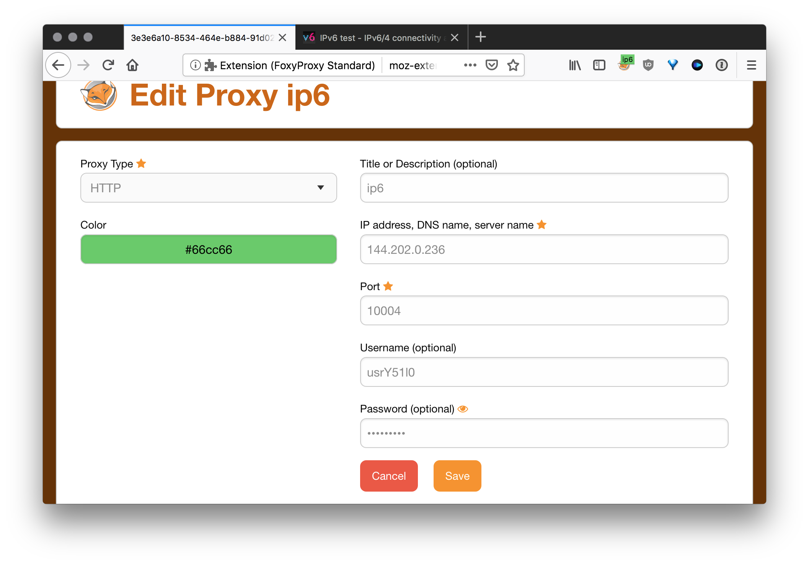
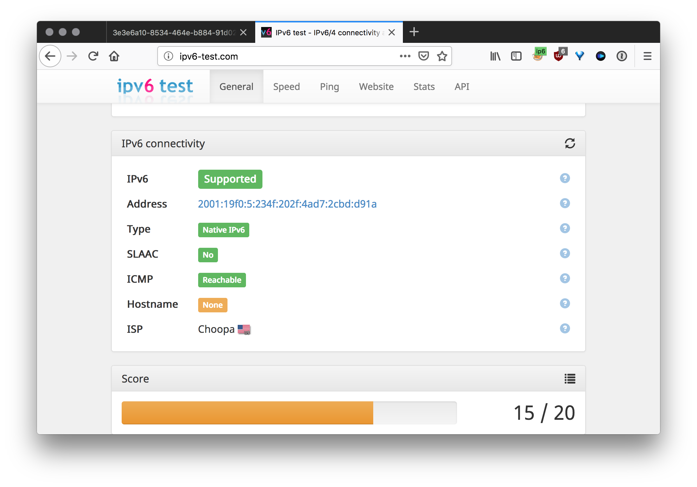

This script for install and auto configure http proxy.

Script works on Centos 7
and can generete ip6's for \64 sub.


## Installation

[Video tutorial](https://vimeo.com/user93341880/review/316140866/fcd94d4e86)

[Buy VPS  Vultr](https://www.vultr.com/?ref=7502192)
```
bash <(curl -s "https://raw.githubusercontent.com/dukaev/ipv6_proxy/master/scripts/install.sh")
```
After installation you can dowload file.
The file is organized like this:
```
IP4:PORT:LOGIN:PASS
```
Use [format](http://buyproxies.org/panel/format.php
) for formatted proxy list

## Testing proxy

Firefox with [FoxyProxy](https://addons.mozilla.org/en-US/firefox/addon/foxyproxy-standard/)


Go to check [ip6 test](http://ipv6-test.com/)
