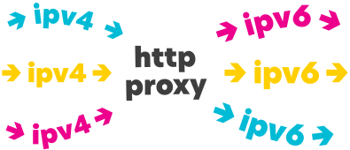
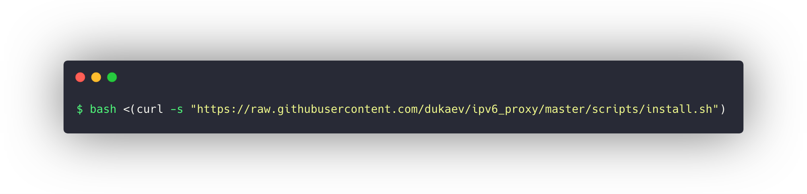

This script for install and auto configure http proxy.

Script works on Centos 7
and can generete ip6's for \64 sub.


## Installation

```
bash <(curl -s "https://raw.githubusercontent.com/dukaev/ipv6_proxy/master/scripts/install.sh")
```

Tested on [Vultr](https://www.vultr.com/?ref=7502192)